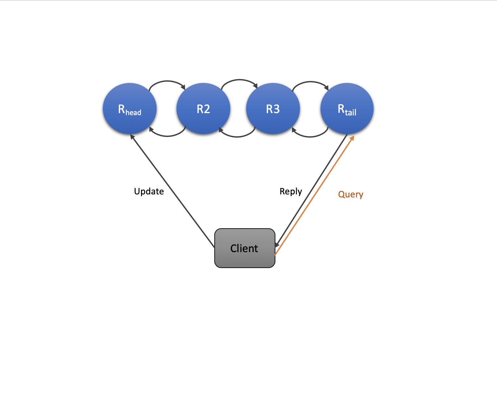
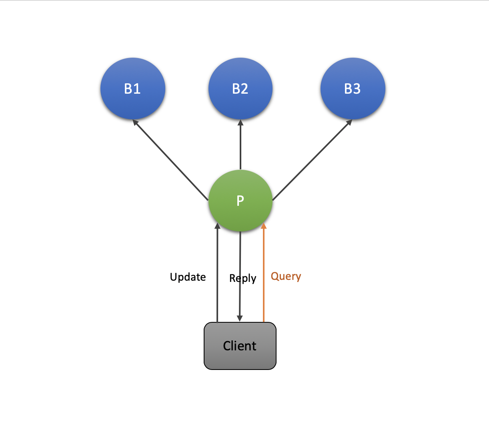
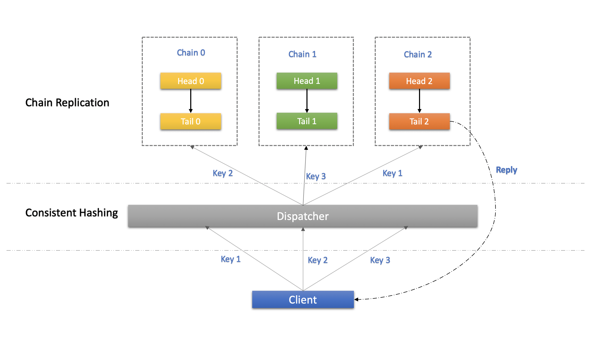

# Fault Tolerant Key Value Store
Implementation of fault tolerant  KeyValue service using chain-replication. 
This is project is more focused on chain-replication technique, it uses [boltdb](https://github.com/etcd-io/bbolt) for the underlying KeyValue storage.

| Replication Techniques             | Failure Model | Consistency Model                          |
|------------------------------------|---------------|--------------------------------------------|
| Chain Replication                  | Fail Stop     | Strong                                     |

## Chain Replication
The chain replication algorithm is a variation of master/slave (primary/backup)
replication where all servers that are responsible for storing a
replica of an object that are arranged in a strictly-ordered chain. The
head of the chain makes all decisions about updates to an object.
The head’s decision is propagated down the chain in strict order.
The number of replicas for an object is determined by the length
of the replica chain that is responsible for that object. To tolerate f
replica server failures, a chain must be at least f + 1 servers long.
Operations on objects within the chain are linearizable when all updates are processed by the head of the
chain and all read-only queries are processed by the tail of the
chain. Strong consistency is maintained because read requests are
processed only by the tail of the chain.

|  |  |
|:---:|:---:|
| Chain Replication| Primary Backup |
| Higher Latency compared to Primary Backup | Primary dispatches call to backup in parallel so latency is low|
| Better throughput as tail can respond directly|  Primary responsible for update & query|

## Implementation

### Single Chain

* Reply - The reply of every request is sent by tail.
* [Query]() - Every query request is directed to the tail of the chain and processed there atomically.
* [Update]() - Each update request is directed to head of the chain.The request is processed atomically and then forwarded along a **reliable FIFO link** to the next element of the chain (where it is handled and forwarded), and so on until the request is handled by the tail. 

#### Coping With Server Failures
In order to detect failures of server that is part of the chain (fail-stop assumption, so all failures will be detected), and reconfigure the chain by eliminating failed the server, A special service is employed, called **master** that
* detects failure of server.
* reconfigures the chain by informing each server in the chain of its new predecessor or new successor in the new chain obtained  by deleting the failed server.
* informs clients about (or book keeping of) current head & tail.

### Multi Chain

For large scale store we would like to partition key sets among multiple chains. To manage partitions and map a given key to particular chain, Dispatcher service is used.
Client sends all its request to Dispatcher, however update replies are sent by tail of the given chain directly.

