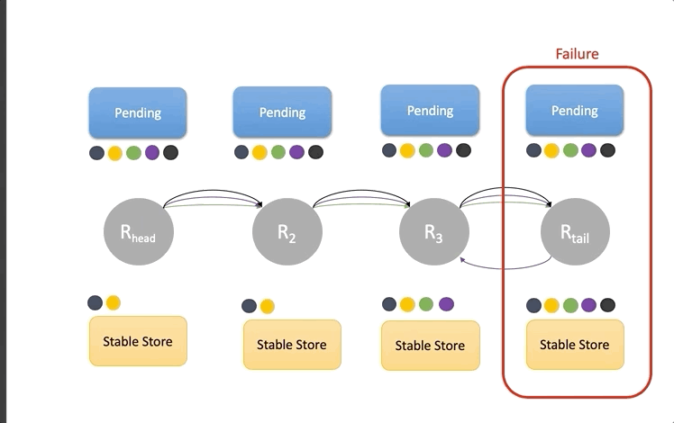
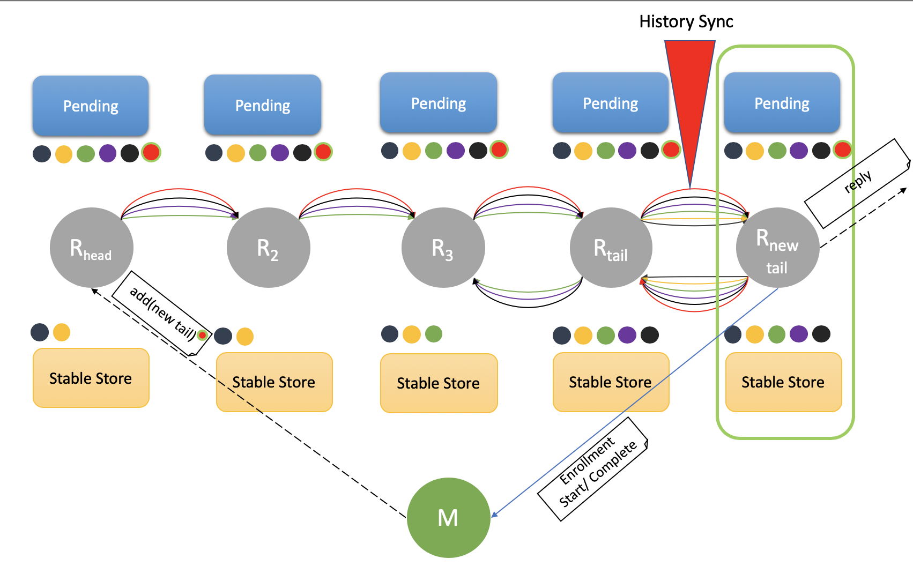

## Failure, Recovery & Chain Reconfiguration

### Failure
Current implementation makes assumption that master never fails. 
Failures are fail-stop in nature 
* each server halts in response to a failure rather
  than making erroneous state transitions, and
* a server’s halted state can be detected by the
  environment
  
Every node sends heart-beat (alive) signal to master. Master detects node failure if no signal is received within health checkup interval. 

There are 3 different failure scenarios in chain -
* Failure of Head
* Failure of Tail
* Failure of some other node in chain

#### Failure of Head

This is most simplest scenario, master simply removes the Head and makes the successor new Head. 
 
 Altering the set of servers in the chain could change the contents of Pending set, Pending set is defined as the set of requests received by any server in the chain and not yet processed by the tail,
  so deleting server H from the chain has the effect of removing from Pending set those requests received by H but not yet forwarded to a successor. Its in line with the assumption that request can be rejected or lost.

#### Failure of Tail
In this scenario Master removes the tail T and makes it predecessor T-1 new Tail. Changing tail from T to T-1 potentially increases the set of requests completed by tail which is because of decrease in set of requests in Pending state.

### Failure of some other node in chain
Failure of a server R internal to chain is handled by deleting R from the chain. The master first informs R's successor R+1 of the new chain configuration and then informs R's predecessor R-1.

The Update Propagation Invariant is preserved by requiring that the first thing a server R−1 connecting
to a new successor R+1 does is: send to R+1  those requests in Pending (R−1) that might not have reached R+1; only after those have been sent may R−1 process and forward
requests that it receives subsequent to assuming its new chain position. This is done by maintaining internal Sent state for each replica, requests that were forwarded but not acked yet.

### Chain Extension (Node Enrollment)
Every node is aware about master location. When node starts , it starts chain extension by sending chain enrollment/registration msg to master. Master then injects the new add tail request just like normal update request by sending it to Head of the chain.
When this request reaches current tail, tail syncs all its history with new node and forwards all incoming requests to new tail thereafter. New tail then sends enrollment/registration complete msg to master and master updates it configuration with new Tail.

Failure during chain extension is handled in same way as mentioned above.

 